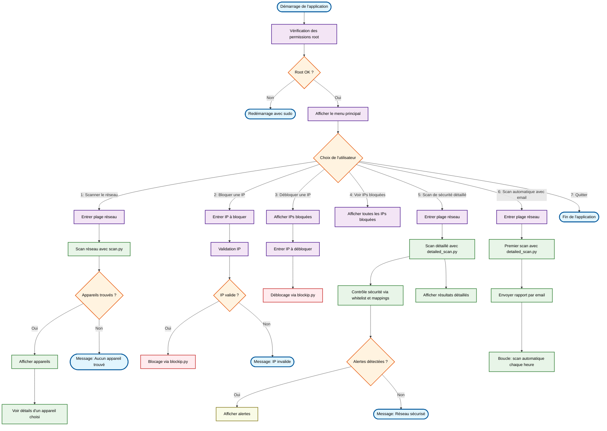

# Diagramme d'Activité - SECNET

```mermaid
flowchart TD
    A(["Démarrage de l'application"]) --> B["Vérification des permissions root"]
    B --> C{"Root OK ?"}
    C -->|Non| D(["Redémarrage avec sudo"])
    C -->|Oui| E["Afficher le menu principal"]

    E --> F{"Choix de l'utilisateur"}
    F -->|"1: Scanner le réseau"| G["Entrer plage réseau"]
    G --> H["Scan réseau avec scan.py"]
    H --> I{"Appareils trouvés ?"}
    I -->|Oui| J["Afficher appareils"]
    J --> K["Voir détails d'un appareil choisi"]
    I -->|Non| L(["Message: Aucun appareil trouvé"])

    F -->|"2: Bloquer une IP"| M["Entrer IP à bloquer"]
    M --> N["Validation IP"]
    N --> O{"IP valide ?"}
    O -->|Oui| P["Blocage via blockip.py"]
    O -->|Non| Q(["Message: IP invalide"])

    F -->|"3: Débloquer une IP"| R["Afficher IPs bloquées"]
    R --> S["Entrer IP à débloquer"]
    S --> T["Déblocage via blockip.py"]

    F -->|"4: Voir IPs bloquées"| U["Afficher toutes les IPs bloquées"]

    F -->|"5: Scan de sécurité détaillé"| V["Entrer plage réseau"]
    V --> W["Scan détaillé avec detailed_scan.py"]
    W --> X["Contrôle sécurité via whitelist et mappings"]
    X --> Y{"Alertes détectées ?"}
    Y -->|Oui| Z["Afficher alertes"]
    Y -->|Non| AA(["Message: Réseau sécurisé"])
    W --> AB["Afficher résultats détaillés"]

    F -->|"6: Scan automatique avec email"| AC["Entrer plage réseau"]
    AC --> AD["Premier scan avec detailed_scan.py"]
    AD --> AE["Envoyer rapport par email"]
    AE --> AF["Boucle: scan automatique chaque heure"]

    F -->|"7: Quitter"| AG(["Fin de l'application"])

    classDef startEnd fill:#e1f5fe,stroke:#01579b,stroke-width:3px,color:#000
    classDef process fill:#f3e5f5,stroke:#4a148c,stroke-width:2px,color:#000
    classDef decision fill:#fff3e0,stroke:#e65100,stroke-width:2px,color:#000
    classDef scanProcess fill:#e8f5e8,stroke:#2e7d32,stroke-width:2px,color:#000
    classDef blockProcess fill:#ffebee,stroke:#c62828,stroke-width:2px,color:#000
    classDef message fill:#f9fbe7,stroke:#827717,stroke-width:2px,color:#000

    class A,D,L,Q,AA,AG startEnd
    class B,E,G,M,N,R,S,U,V,AC process
    class C,F,I,O,Y decision
    class H,J,K,W,X,AB,AD,AE,AF scanProcess
    class P,T blockProcess
    class Z message
```